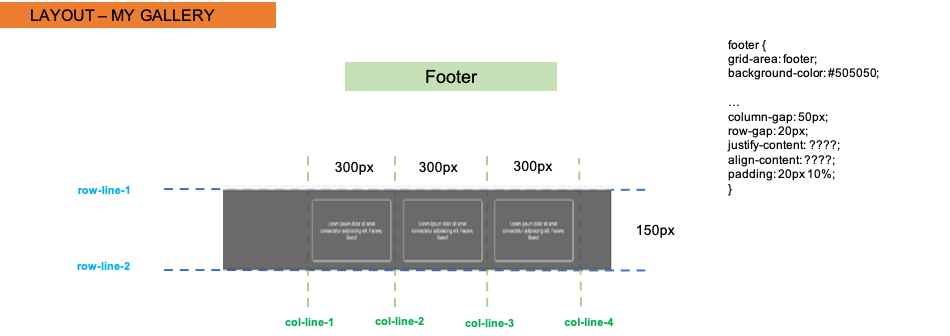

# Grid Galerie

**[have a look](https://holledrums.github.io/galerie_grid/)**

---

Using CSS Grid and Flexbox to recreate the reference image shown below -

#### Navigation

- About Project
  - _Description_
  - _Developed With_
- How to use this Project
  - _Description_
  - _Developed With_
- Contact
  - _Mail_
  - _GitHub_
  - _LinkedIn_
- Used Tools
  - _Fonts_
  - _Design_
  - _Icons_
  - _Colors_

---

### About Project

creating a galerie using grid and flex

### How to use this Project

##### Developed With

- [x] _HTML5_
- [x] _CSS3_
- [ ] _SASS_
- [ ] _SCSS_
- [ ] _JavaScript_
- [ ] _React_
- [ ] _Bootstrap_
- [x] _npm_
- [ ] _..._

---

### Contact

Mail: <holgeraliusklose@gmail.com> 
GitHub: [Holledrums](https://github.com/holledrums) 
LinkedIn: [Holger Klose](https://www.linkedin.com/in/holger-klose-240831147/)

---

### Used Tools

- [icons](https://)
- [Canva](https://www.canva.com/)
- [npm](https://www.npmjs.com/)
- [Google Fonts](https://fonts.google.com/)
- [Visual Studio Code](https://code.visualstudio.com/)
- [ColorZilla](https://www.colorzilla.com/chrome/)

---

Made with ❤️ by me

# Grid Document Layout

Using CSS Grid (and Flexbox if you like) recreate the reference image shown below -

## Layout designs

### Make use of the images and information below to come to the best solution -

- The whole document

- Main section

- Second part

- Footer

## The online version

In order to see live version, just [click...!](https://hsnakk.github.io/UIB_Layout_Grid_Exercise-1/)

#### Good luck and have fun!
